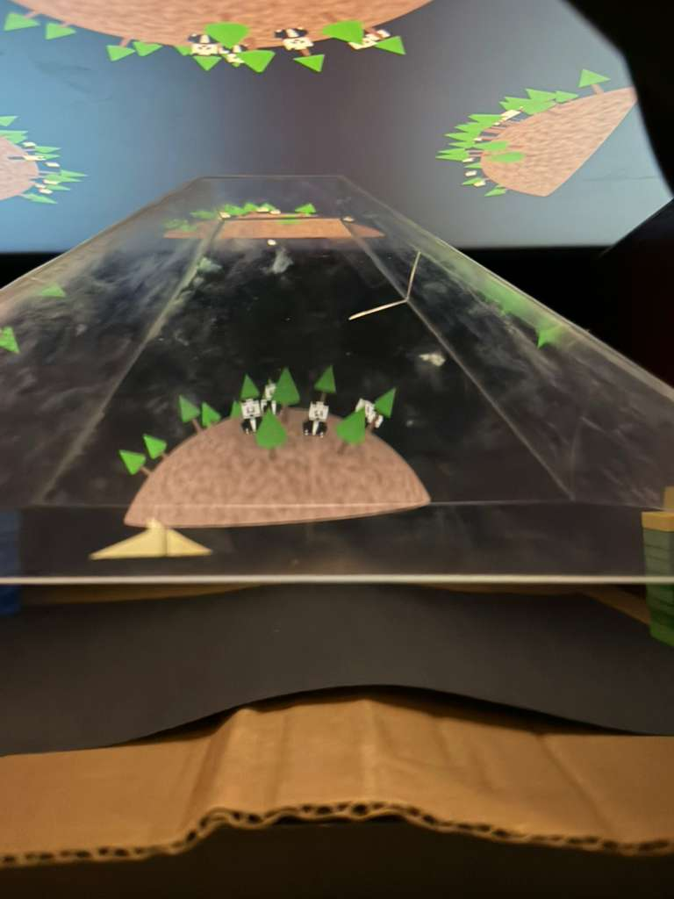
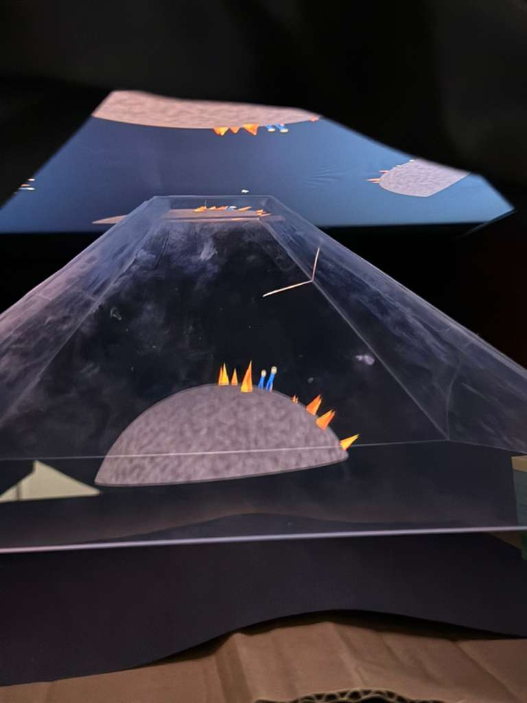

# A2RU Holographic Ecosystem Simulation

This project is a prototype holographic installation designed to visualize the delicate balance and human impact on an ecosystem. It was created for the **[a2ru 2026 Emerging Creatives Student Summit: Rewilding](https://a2ru.org/event/2026-emerging-creatives-student-summit-rewilding/)**.

The installation uses a digital implementation of the **Pepper's Ghost effect** to project a 3D living world into physical space, allowing users to interact with a "Rewilding" simulation via a remote control interface.

### 🎭 What is Pepper's Ghost?
Pepper's Ghost is an illusion technique used in theaters, haunted house attractions, and museum displays. It works by reflecting an image off a sheet of glass (or transparent plastic) angled at 45 degrees. The viewer sees the reflection of a hidden object overlaid on the scene behind the glass, making the object appear like a translucent, 3D "hologram" floating in mid-air.

In this project, we use a modern digital variant:
- **The Screen**: Functions as the hidden "stage" or source of light.
- **The 4-View Array**: The simulation renders four versions of the same world—one for each side of a transparent pyramid.
- **The Prism**: A plastic pyramid sitting on the screen reflects these four images toward the center.
- **The Result**: A volumetric illusion where the 3D model appears to exist physically inside the center of the pyramid.

## 📸 Demo




## 🌟 Concept

The simulation demonstrates how specific human interventions—such as building factories, spawning humans, or reintroducing pandas—create cascading effects within a micro-ecosystem. By using a holographic display, we aim to bridge the gap between abstract environmental data and a tangible, immersive prototype for educational museum or gallery installations.

## 🛠 Technical Implementation

### 1. Holographic Projection (Pepper's Ghost)
The projection is achieved by rendering the scene from four distinct virtual cameras (Top, Bottom, Left, Right) positioned around the center of the world.
- **Viewport Scissoring**: The WebGL viewport is split into four quadrants.
- **Camera Orientation**: Each view is precisely rotated and mapped so that when reflected through a transparent pyramid (Pepper's Ghost prism), they converge into a single, upright 3D image in the center of the structure.
- **Dynamic Distortion**: The simulation allows real-time adjustment of camera distance and spread to calibrate the image for different physical prism sizes.

### 2. Ecosystem Simulation Logic
The world operates on a rule-based logic system:
- **Rewilding**: Pandas can breed if bamboo is present and will naturally spread trees.
- **Human Impact**: Humans build houses and factories. Factories increase climate risk, eventually triggering a "Forest Fire" event if the industrial threshold is passed.
- **Cascading Effects**: Fires destroy trees and bamboo, which in turn causes pandas to starve, illustrating the fragility of the habitat.
- **Procedural Design**: All models (Minecraft-style humans, houses, factories, and trees) are procedurally generated from cube primitives and merged into optimized Vertex Array Objects (VAOs).

### 3. Procedural Rendering & Shaders
- **Vanilla WebGL2**: Built without external 3D engines to maintain low-latency and precise control over the holographic viewports.
- **GLSL Noise Shaders**: Implements a procedural 3D noise function in the fragment shader to create high-frequency terrain textures without the need for large external asset files.
- **Matrix Math**: Uses `gl-matrix` for all 4x4 model-view-projection translations and quaternion-based rotation for object placement on the spherical Earth.

### 4. Real-time Control System
- **Node.js + Socket.io**: A backend relay allows a separate "Controller" device (like a phone or tablet) to spawn objects and trigger events in the simulation.
- **State Feedback**: The simulation broadcasts real-time population counts back to the controller's HUD.

## 🚀 How to Run

1. **Install Dependencies**:
   ```bash
   npm install
   ```

2. **Start the Backend**:
   This handles the real-time communication between the controller and the hologram.
   ```bash
   node server.js
   ```

3. **Launch the Simulation**:
   Serve the root directory using any static file server (e.g., Python).
   ```bash
   python -m http.server 8000
   ```
   Open `http://localhost:8000` on your holographic display.

4. **Launch the Controller**:
   Open `http://localhost:3000` on a second device to interact with the world.

---

*Developed for the a2ru 2026 Emerging Creatives Student Summit.*
